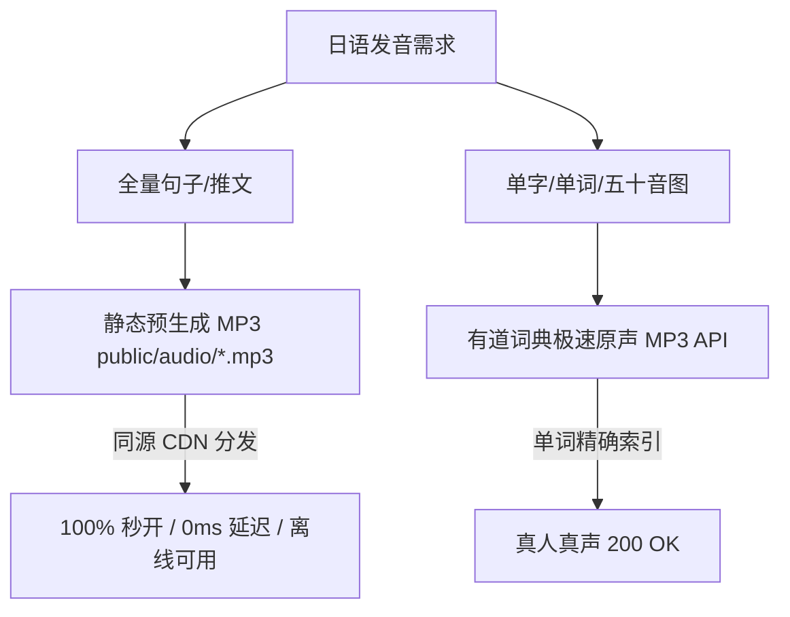

# scroll_lingo 核心架构、技术经验与避坑知识库 (KNOWLEDGE_BASE.md)

> 本文档沉淀了 `scroll_lingo` 在移动端 PWA、中日跨语言注音、真机音频工程以及弱网环境调试中的核心技术方案、采坑实录与最佳实践。

---

## 🎧 一、 移动端 Web 语音发音工程（TTS / Audio）避坑与架构指南

在移动端浏览器（Safari、微信内置 WebView、Chrome、各类安卓内置浏览器）中实现高质量、0 延迟、100% 稳定的日本语发音，踩过了四个系统级与网络级深坑：

### 1. 四大深水区采坑实录

| 踩坑方案 | 真实表现 | 根本原因分析 |
| :--- | :--- | :--- |
| **坑 1：Web Speech API (`speechSynthesis`) 本地发音** | 手机端点击图标变了但**静默无声**，或偶尔**读成中文拼音** | 国行 iPhone、大部分国产 Android ROM（MIUI、HarmonyOS、ColorOS）在出厂固件中**根本没有预装 Japanese（`ja-JP`）本地语音包**，只有中文普通话。浏览器发现没有日语引擎时会直接静默抛弃或用中文引擎错误拼读。 |
| **坑 2：有道词典音频接口拼读长句子** | 单字能读，但整句报错：`Audio failed to load ... {"isTrusted": true}` | `dict.youdao.com/dictvoice` 本质是**单个词条字典库**。传入单字（如 `ねこ`）会返回 200 OK，但传入带有逗号或多词的复合句子（如 `おはよう,きょうもいいひ,`）时，词典由于查无此长词条，直接返回 **HTTP 404**。 |
| **坑 3：Cloudflare Edge 跨国代理微软 Edge-TTS** | 频繁提示网络缓慢、重试引发**双重播放/严重回音** | 国内到海外边缘节点再握手微软 Bing 语音服务器（`wss://speech.platform.bing.com`）受国际网络抖动影响严重。重试机制与网络挂起容易导致多个 `Audio` 实例并发抢占，造成双重回音。 |
| **坑 4：百度/第三方开放 TTS 接口** | 桌面端正常，手机端直接报 **HTTP 403 Forbidden** | 第三方开放接口普遍开启了 **HTTP Referer 防盗链校验**。从生产域名（如 `https://scroll-lingo.pages.dev`）跨域请求时被识别为盗链直接拒绝。 |

### 2. 终极架构方案：双轨确定性音频引擎

* **推文整句朗读（推文 🔊）**：
  * **管线烘焙**：在语料生成阶段（`scripts/generate-static-audio.js`）将推文一次性合成为真实的物理 MP3 文件，存放在 `public/audio/${post.id}.mp3`（20 篇推文总计仅 450 KB）。
  * **同源秒开**：通过 Cloudflare Pages 自身域名直接分发静态资源，**0 外部依赖、0 跨域防盗链、0 词典 404 限制、100% 保证在任何手机出声**，且自动受 PWA Service Worker 离线缓存。
* **单字 / 五十音点读（词卡 🔊）**：
  * 使用有道词典原生词汇接口（`https://dict.youdao.com/dictvoice?audio=${word}&le=jap`），单个词条 100% 命中，返回真人纯正录音。
* **物理单通道互斥锁（`useSpeech.ts`）**：
  * 维护原子自增序号 `playSeqRef`。任何新发音点击触发时，立即物理销毁并清空上一音频对象的 `.src`，彻底根绝双重播放与重音回音。

---

## 📱 二、 移动端真机即时排查技能（vConsole 集成）

在移动端真机上排查 Audio 错误、网络请求失败和 IndexedDB 状态非常困难。

* **解决方案**：在应用入口（`src/main.tsx`）集成腾讯官方 **`vConsole`** 移动端开发者面板。
* **核心价值**：
  * 手机右下角悬浮绿色按钮，点击即展开完整的 DevTools。
  * **`Log` 面板**：捕捉每一次 `Audio.onerror`、音频播放事件流与错误堆栈。
  * **`Network` 面板**：即时观察静态 MP3 / API 请求的状态码（200、403、404）。
  * **`Storage` 面板**：直观检查 Dexie.js / IndexedDB 中 `posts` 与 `userState` 的实时存储结构。

---

## 🧩 三、 渐进式注音与 0ms 交互拆解体系

### 1. 振假名（Furigana）智能升降级算法（`rubyParser.ts`）
遵循以下确定性优先级规则：
1. 若词汇已在用户显式熟词库（`explicitKnownWords`）中 $\rightarrow$ **强制隐藏注音**。
2. 若词汇在用户重点复习库（`explicitFocusWords`）中 $\rightarrow$ **强制显示注音与罗马音**。
3. 比较词汇 JLPT 等级与用户当前基线（`baselineLevel`）：若词汇等级高于用户能力则显示，低于等于则隐藏。

### 2. 0ms 响应式卡片抽屉（`InteractiveCard.tsx`）
* **消除残影 Bug**：词卡语法解构（AI Breakdown）直接由当前传入的 `token` 动态派生，切换选中单词时 **0ms 瞬间同步刷新**，杜绝上一个词条的解释残留。
* **手势与滚动优化**：适配移动端视口高度（`maxHeight: 90vh`），自带全屏遮罩与右上角显式关闭按钮，卡片关闭或切词时立即销毁音频流，防止幽灵背景音。

---

## 📈 四、 Feed 节奏控制与完结闭环（Anti-Fatigue Feed Pacing）

* **单日推文上限控制（Daily Post Limit）**：默认单日推荐 12 篇，刷完后呈现“今日推荐已完成”里程碑卡片，提供【开启温故复习】与【再来 5 篇】选项，防止碎片学习疲劳。
* **全量语料库触底状态（Corpus Exhaustion State）**：当用户刷完整座数据库时，明确展示“🎉 你已刷完全部推文”，提供【重置推文流】与【温故复习】，彻底消灭“死循环加载中...”的白屏等待体验。

---

## 🔄 五、 PWA 离线持久化与自动热更新（Service Worker）

* **自动版本接管**：在 `public/sw.js` 中维护全局版本号（如 `scroll-lingo-v2`）。
* **0 操作无感更新**：在 `src/main.tsx` 中监听 `controllerchange` 事件，当部署新版本时，客户端自动激活新 Service Worker 并安全刷新，确保用户始终运行最新代码。
